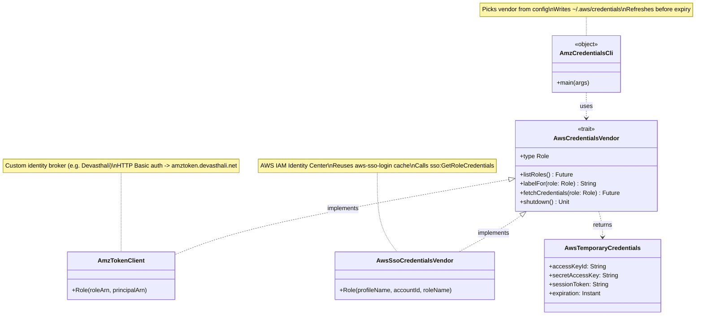
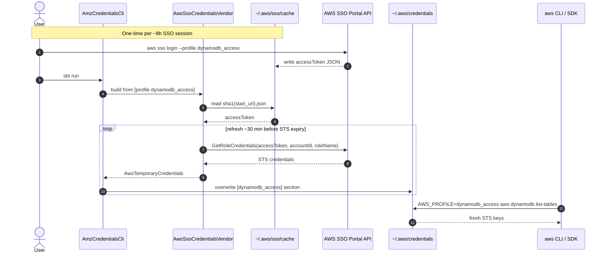

# amz-cloud-auth

Fetches AWS temporary credentials from a federated identity provider and
keeps `~/.aws/credentials` automatically refreshed, so any tool that reads
the credentials file (AWS CLI, SDKs, Terraform, kubectl-aws-auth, ...) sees
fresh keys without manual `aws sso login` cycles.

Two [AWS federation patterns](https://docs.aws.amazon.com/signin/latest/userguide/federated-identity-overview.html) are supported:

| `vendor=` | AWS pattern | Source | Auth model |
|----------|-------------|--------|-----------|
| `sso`    | [IAM Identity Center](https://docs.aws.amazon.com/singlesignon/) (formerly AWS SSO) | AWS-managed SSO | Reuses the access token from `aws sso login` (cached at `~/.aws/sso/cache/`) and calls `sso:GetRoleCredentials`. |
| `broker` | [Custom identity broker](https://docs.aws.amazon.com/IAM/latest/UserGuide/id_roles_providers_enable-console-custom-url.html) | Your own service that proxies corporate LDAP -> STS (e.g. Amazon-internal Devasthali) | `username:password` over HTTP Basic auth against your broker's endpoint. |

Pick the source in `src/main/resources/application.properties`.

---

## Quickstart - AWS SSO mode

1. Define the SSO profile in `~/.aws/config` (legacy profile format):

   ```ini
   [profile dynamodb_access]
   sso_account_id  = 111111111111
   sso_start_url   = https://devasthali-sso.awsapps.com/start
   sso_region      = us-east-1
   sso_role_name   = DynamoDBAccess
   region          = us-east-1
   output          = json
   ```

2. One-time browser login (and any time the ~8h SSO session expires):

   ```bash
   aws sso login --profile dynamodb_access
   ```

   This writes `~/.aws/sso/cache/<sha1>.json` containing the OIDC `accessToken`.

3. Configure this app in `src/main/resources/application.properties`:

   ```properties
   vendor                 = sso
   aws.sso.profile        = dynamodb_access
   auth.credentials.path  = /Users/you/.aws/credentials
   auth.credentials.name  = dynamodb_access
   ```

4. Run it:

   ```bash
   sbt run
   ```

   Every ~30 min before the STS creds expire the app re-calls
   `sso:GetRoleCredentials` and overwrites the `[dynamodb_access]` section of
   `~/.aws/credentials`. Other processes that read that file see fresh keys
   automatically.

5. Use the creds from any tool:

   ```bash
   AWS_PROFILE=dynamodb_access aws dynamodb list-tables
   ```

If the underlying SSO access token expires (default ~8h), the app stops
with a clear error pointing at the cache file path - re-run `aws sso login`
and restart the app.

---

## Quickstart - Custom identity broker (e.g. Devasthali) mode

1. Trust the internal endpoint's TLS cert (one-time):

   [Install cert for endpoint](https://github.com/devasthali-os/install-cacert.kotlin#usage)
   so that stupid java can TLS connect.

   ```bash
   java -jar build/lib/install-cacert.kotlin.jar [host]:[port]
   # was enough on Mac Unix OS
   # cp jssecacerts $JAVA_HOME/jre/lib/security

   # Windows: see https://stackoverflow.com/a/32074827/432903
   keytool -exportcert -alias endpoint.com-1 -keystore jssecacerts -storepass changeit -file endpoint.com.cert
   keytool -importcert -alias endpoint.com -keystore $JAVA_HOME/jre/lib/security/cacerts -storepass changeit -file endpoint.com.cert
   ```

2. Configure:

   ```properties
   vendor                  = broker
   broker.endpoint         = amztoken.devasthali.net
   broker.resources.roles  = /authentication/roleArns
   broker.resources.tokens = /authentication/awsToken
   auth.credentials.path   = /Users/you/.aws/credentials
   auth.credentials.name   = aws-profile
   auth.server.certs.store = /path/to/jssecacerts
   ```

3. Run; the app will prompt for username/password, then show a role picker.

   ```bash
   sbt run
   ```

For reference, the underlying HTTP exchange is:

```bash
curl -XPOST \
  --header "Content-Type: application/json" \
  --header "Authorization: Basic <base64(username:password)>" \
  -d '{"Role":"arn:aws:iam::accountId:role/SomeRole","Principal":"arn:aws:iam::accountId:saml-provider/DWM"}' \
  https://amztoken.devasthali.net/authentication/awsToken

{
  "SecretAccessKey": "REDACTED",
  "AccessKey":       "REDACTED",
  "Expiration":      "REDACTED",
  "SessionToken":    "REDACTED"
}
```

Encoding the `username:password` for the `Authorization` header:

```bash
openssl enc -base64 <<< 'your_amz_username:your_amz_password'
openssl enc -base64 -d <<< whatever_base64
```

---

## Architecture

### Components



Add a new credential source by implementing `AwsCredentialsVendor`; no CLI
changes required.

### Runtime flow (SSO vendor)



---

## Build a fat jar

```bash
sbt assembly
# -> target/scala-3.3.4/amz-authentication-assembly-1.0.jar
```

Then run anywhere a JRE 17+ is available:

```bash
java -jar amz-authentication-assembly-1.0.jar
```
